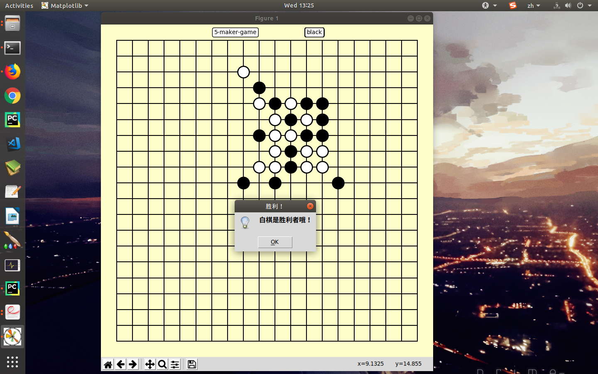

# 一个五子棋的小玩意

| 作者 : 2813234110@qqcom |
| --- |
| 时间 : 10/23 |
| 备注 : 这是一个面向过程的小程序 |

---

#### 要求-->

1. 画出棋盘(这里用的Python的一个用于数据分析的matplotlib模块作为替代).
2. 初始先手为黑棋, 每次行动后交换棋子颜色.
3. 每次落子都进行一次胜利判断, 如果胜利则冻结棋盘.

#### 画出棋盘 : (过程有点尴尬, 先这么用着)
    
```
    fig = plt.figure(figsize=[8, 8])
    fig.patch.set_facecolor((1, 1, 0.8))
    ax = fig.add_subplot(111)
    for x in range(chessboard):
        ax.plot([x, x], [0, chessboard - 1], 'k')
    for y in range(chessboard):
        ax.plot([0, chessboard - 1], [y, y], 'k')
    ax.set_position([0, 0, 1, 1])
    ax.set_axis_off()
    ax.set_xlim(-1, chessboard)
    ax.set_ylim(-1, chessboard)
```

#### 判断方式(算法很繁琐, 必须要改进)

* 这是其中一个方向的判断计数..

```

    count = 0
    # up
    while (now_x_s, now_y_s) in chess_place and count < 6:
        if chess_place[(now_x, now_y)] == chess_place[(now_x_s, now_y_s)]:
            pos_y += 1
        else:
            break
        now_y_s += 1
        count += 1

```

---
### 先这样吧, 后面再改改
* 这是样子:


